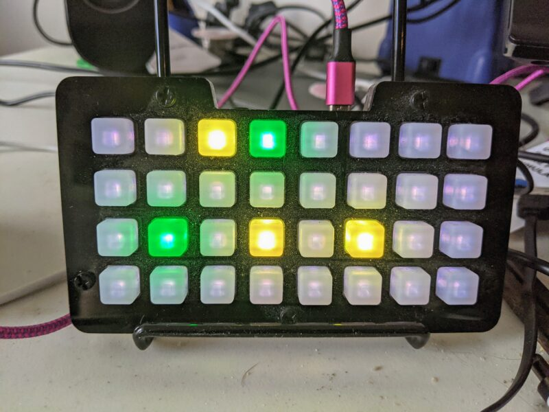

# bloohm
visual bloom filter to display process status as neotrellis m4 output

# Why?
I like to see process status on my very bright [RGB LED board](https://www.adafruit.com/product/4020).
Until now, I could only turn the whole board colors, yellow for "process running" with red for "non-zero exit" and green for "zero exit code".

I want the LEDs for output only, I don't want to do any logic on the neotrellis board.

So, I took an idea from [bloom filters](https://en.wikipedia.org/wiki/Bloom_filter) and run the current directory and command line through three different hashes.
I use the results modulus 32 to figure out which LEDs to update with process status colors.

# What does it look like?

In the image below you can see that one command has finished, and another command is in progress.



# How to make it go?
1. Install bloohm, then add the snippet below to your `~/.zshrc` (no idea if this works in bash).
2. Load the code.py from this repository onto your NeoTrellis M4.
3. run "try ls", and your status LEDs should briefly turn yellow until the command is done, when they turn green.

# The shell snippet

```zsh
# for long running commands
function try () {
	export thecmd="$*"
	bloohm "/dev/ttyACM0" Yellow $PWD:A $thecmd
	time $* && fin || die; # cargo install tally, replacement for time
}

function play_sound () {
	aplay -N -q $HOME/.bin/$1.au
}

function fin () {
	bloohm "/dev/ttyACM0" Green $PWD:A $thecmd
	play_sound monkey # monkey.wav from XEmacs https://bitbucket.org/xemacs/sounds-wav/src
}

function die() {
	bloohm "/dev/ttyACM0" Red $PWD:A $thecmd
	play_sound yeep # yeep.wav from XEmacs https://bitbucket.org/xemacs/sounds-wav/src
	play_sound yeep
}
```
